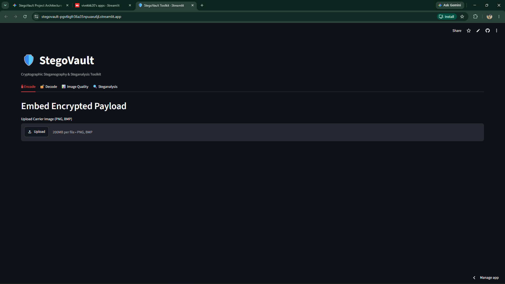
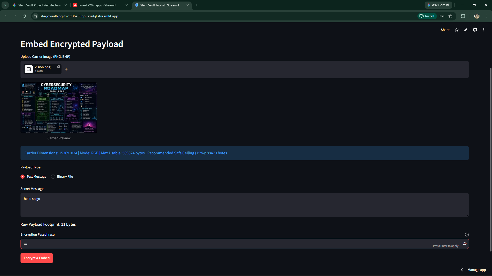
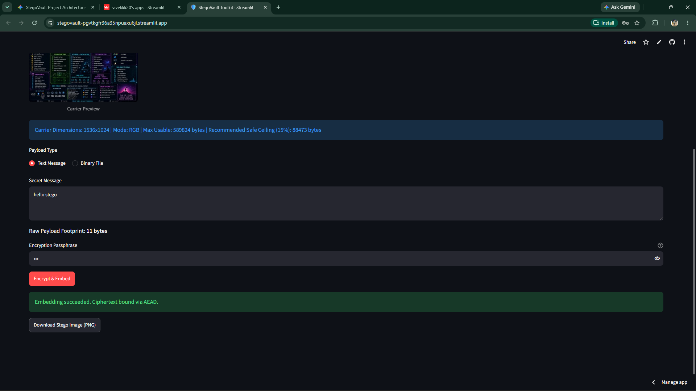
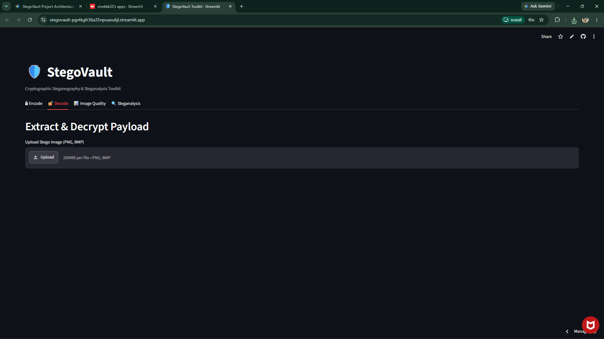

# StegoVault — Cryptographic Steganography & Steganalysis Toolkit

StegoVault is a professional cybersecurity toolkit designed to integrate authenticated cryptography, spatial-domain image steganography, and statistical steganalysis into an educational and practical defensive platform.

## Abstract

In modern digital communications, transmitting confidential data through open networks exposes users to pervasive surveillance, deep packet inspection (DPI), and automated cryptanalysis. While traditional cryptography provides mathematical secrecy, ciphertext is conspicuously unnatural and readily invites adversarial inspection. Conversely, classical Least Significant Bit (LSB) steganography conceals the presence of communication inside digital media but fails catastrophically if detected or tampered with, as naive spatial embedding lacks integrity guarantees and leaves data in cleartext.

StegoVault resolves this fundamental trade-off through a defense-in-depth architectural paradigm where authenticated encryption strictly precedes steganographic concealment. Secret payloads (plain text or arbitrary binary files) undergo zlib pre-compression to minimize carrier footprint and flatten plaintext entropy. Symmetric 256-bit encryption keys are derived using the memory-hard Scrypt key derivation function (N=16384, r=8, p=1) with 16-byte random salts to withstand GPU-accelerated brute-force attacks. Confidentiality and tamper-evident integrity are enforced via AES-256-GCM authenticated encryption bound to Additional Authenticated Data (AAD) within an immutable 56-byte binary wire envelope. The encrypted envelope is embedded sequentially into the spatial LSBs of lossless image carriers (PNG, BMP, TIFF) across RGB color channels while shielding the alpha transparency channel in RGBA carriers. StegoVault incorporates real-time carrier capacity headroom checking (with a 15% safe embedding ceiling), mathematical fidelity evaluation (MSE and PSNR), and statistical steganalysis (bit-plane slicing and Pairs of Values Chi-Square distribution testing). Backed by 77 automated tests and an interactive Streamlit dashboard, StegoVault demonstrates that high perceptual fidelity (PSNR > 70 dB) and robust tamper resistance can be seamlessly united.

## Key Tenets
- **Defense-in-Depth:** Encryption precedes steganographic embedding. If steganography is detected, ciphertext remains protected under standard security models.
- **Integrity First:** Authenticated encryption (AEAD) ensures silent tampering or carrier corruption triggers verification failures.
- **Zero Inventions:** Strictly leverages vetted, standard primitives from the Python `cryptography` ecosystem.
- **Forensic Visibility:** Features tools for carrier capacity checking, perceptual difference analysis (MSE, PSNR), and statistical detection (LSB plane slicing, Chi-Square analysis).

## Core Pipeline
1. **Encode:** Payload -> Compression -> Authenticated Encryption (AES-256-GCM) -> Binary Envelope -> LSB Carrier Embedding -> Stego Image
2. **Decode:** Stego Image -> Bitstream Extraction -> Envelope Parsing -> AEAD Tag Verification & Decryption -> Decompression -> Original Payload

## Screenshots

*StegoVault dashboard overview*

*Secure embedding configuration*

*Successful payload embedding*

*Successful payload extraction and recovery*

## Notice on Carrier Channels
Social media and messaging applications (such as WhatsApp, Discord, Twitter, and Telegram) transcode, compress, or convert images to lossy formats (JPEG/WebP). This permanently strips LSB data. Carriers must be transmitted as uncompressed/lossless files (e.g., PNG, BMP).
