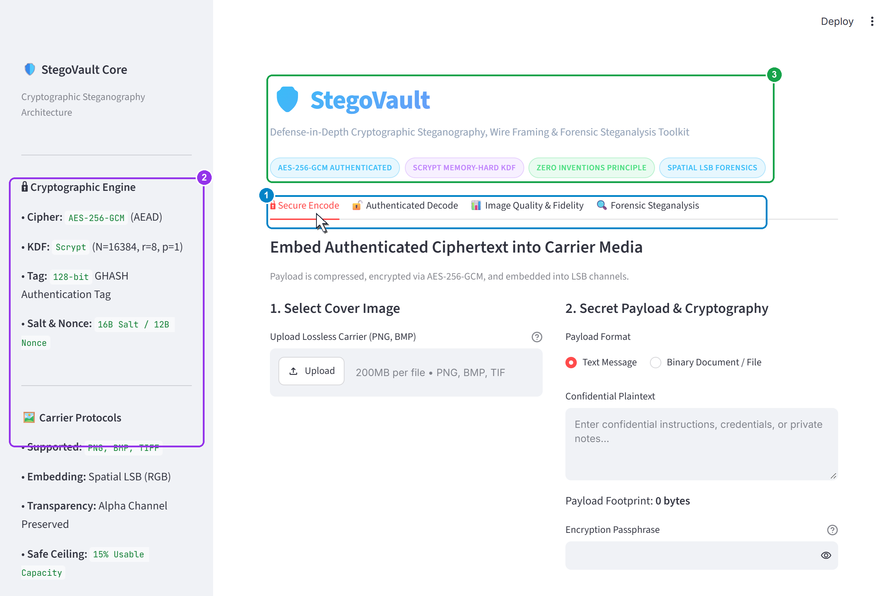
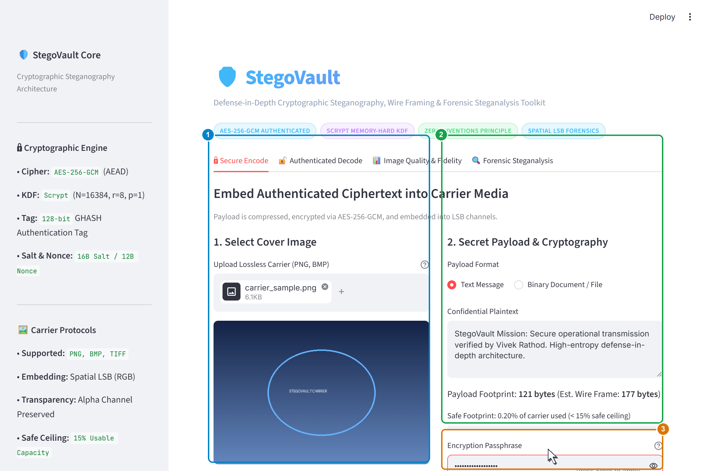
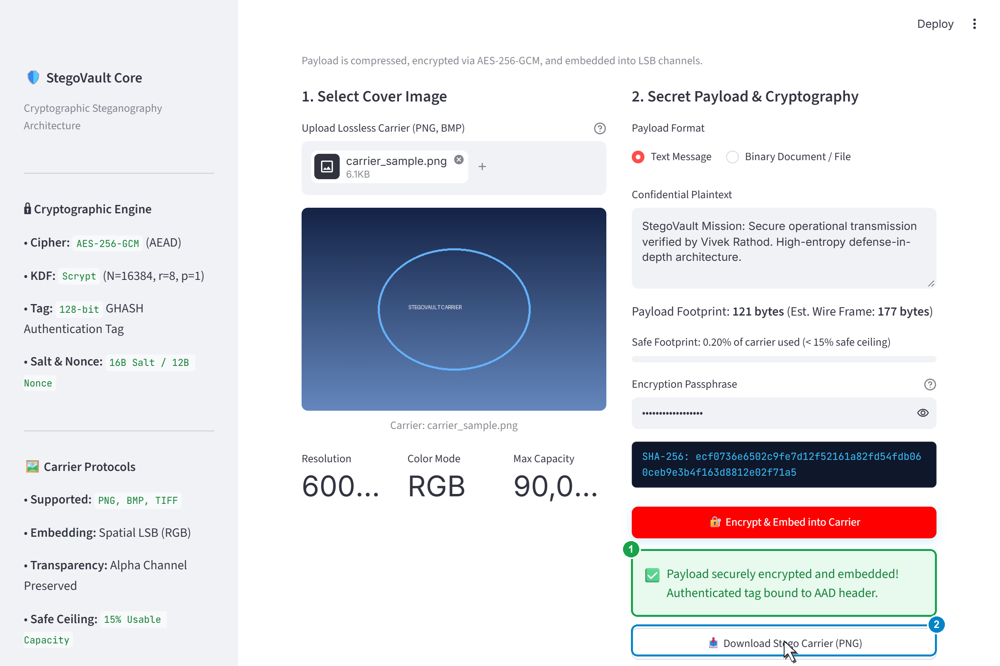
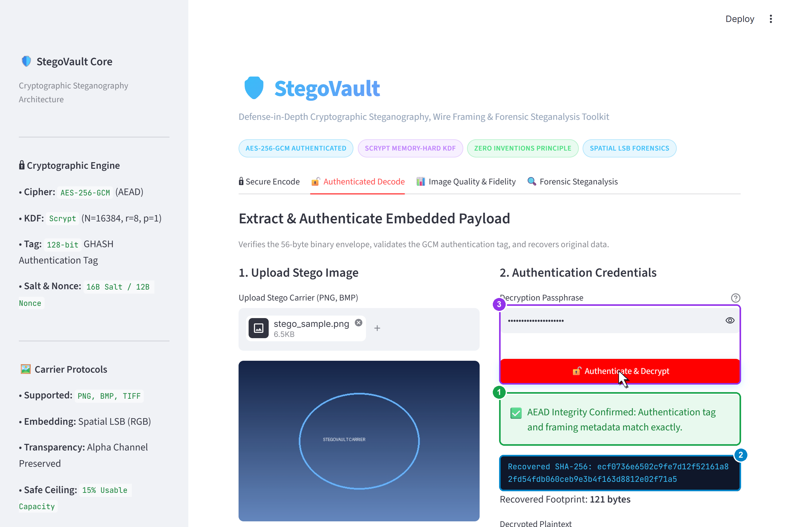
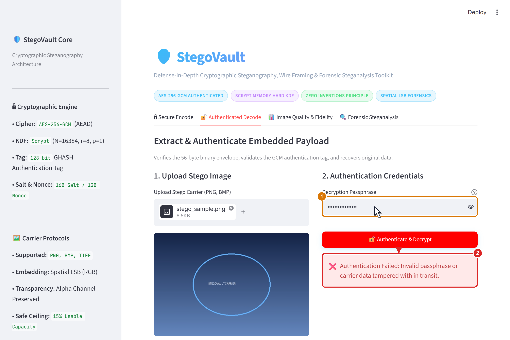
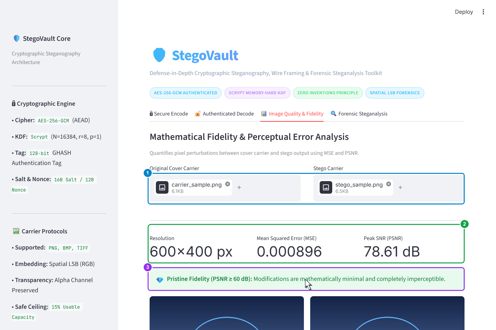
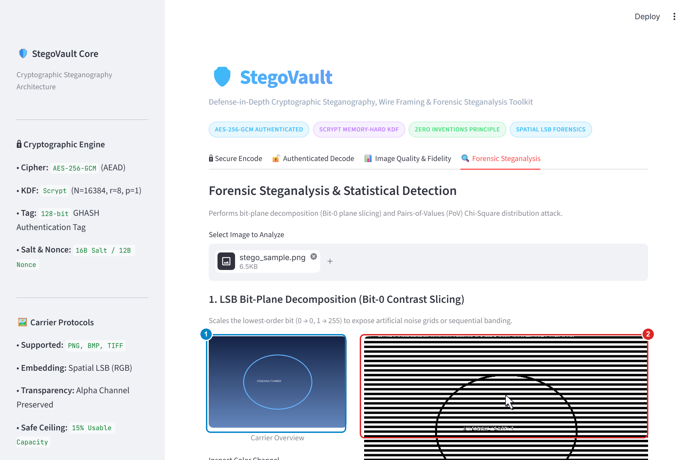
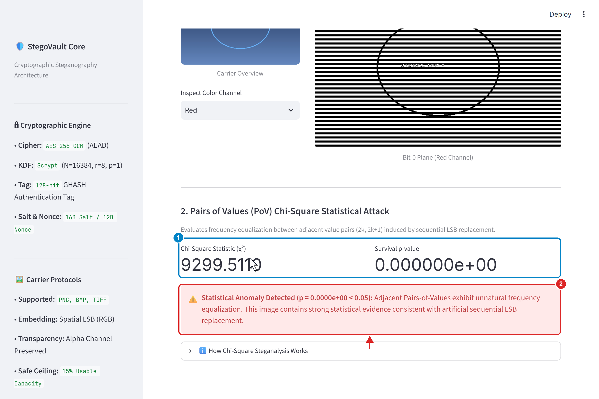

# StegoVault

## Cryptographic Steganography and Steganalysis Toolkit

StegoVault is a practical cybersecurity application that unifies authenticated cryptography, spatial-domain image steganography, perceptual fidelity analysis, and defensive steganalysis into an easy-to-use local defensive security toolkit.

By enforcing a strict **Defense-in-Depth** rule—*encrypt before embedding*—StegoVault ensures that even if an adversary detects hidden data in an image carrier, the underlying payload remains cryptographically impenetrable and tamper-evident.

---

## Features

- **Pre-Embedding Authenticated Encryption:** Encrypts payloads using **AES-256-GCM** with a 128-bit GHASH authentication tag before data touches carrier pixels.
- **Brute-Force Resistant Key Derivation:** Employs the **Scrypt** memory-hard key derivation function ($N=16384, r=8, p=1$) with cryptographically secure 16-byte random salts.
- **Lossless Spatial LSB Embedding:** Sequentially hides data across RGB channels of lossless raster images (PNG, BMP, TIFF) while strictly protecting the alpha channel in RGBA carriers.
- **Tamper-Evident Integrity:** Recomputes and verifies the GHASH authentication tag during extraction; any unauthorized pixel modification or wrong passphrase instantly halts decryption.
- **Dynamic Capacity Headroom Checking:** Monitors payload size in real time against a recommended 15% capacity ceiling to prevent perceptual carrier distortion.
- **Mathematical Image Quality Metrics:** Measures the empirical visual difference between cover and stego carriers via Mean Squared Error (MSE) and Peak Signal-to-Noise Ratio (PSNR > 70 dB).
- **Defensive Forensic Steganalysis:** Audits suspect images using Bit-0 plane slicing (visual anomaly detection) and Pairs of Values Chi-Square statistical testing ($p$-value calculation).
- **Portable 56-Byte Wire Protocol:** Structures payloads inside a self-contained, versioned `SVLT` binary envelope bound as Additional Authenticated Data (AAD).
- **Fully Local Execution:** Runs entirely on your workstation with zero external cloud dependencies or telemetry.

---

## How It Works

```
ENCODING PIPELINE:
Secret Payload ──> zlib Compression ──> Scrypt KDF ──> AES-256-GCM Encrypt ──> SVLT Wire Envelope ──> RGB LSB Embedding ──> Stego Image

DECODING PIPELINE:
Stego Image ──> Bitstream Extraction ──> SVLT Header Parse ──> Scrypt KDF ──> AEAD Tag Verification ──> AES-256-GCM Decrypt ──> Original Payload
```

1. **Encode (Hiding Data):** Plain text or binary payloads undergo optional zlib compression, are encrypted with a 256-bit AES key derived from your passphrase via Scrypt, packaged into a 56-byte `SVLT` envelope, and embedded into RGB pixel least significant bits.
2. **Decode (Recovering Data):** Extracts the sequential bitstream, parses the `SVLT` binary envelope, re-derives the key with Scrypt, validates the 128-bit GHASH tag over ciphertext and AAD, decrypts the payload, and restores the original file or text.

---

## Technology Stack

- **Python 3.14:** Core programming language.
- **Streamlit:** Interactive, responsive graphical web dashboard.
- **Pillow (PIL):** Lossless image validation, raster manipulation, and saving.
- **Cryptography:** Industry-standard AES-256-GCM authenticated cipher and Scrypt key derivation.
- **NumPy:** Vectorized array operations for ultra-fast bit-plane slicing and MSE/PSNR calculation.
- **SciPy:** Statistical calculation engine for Chi-Square cumulative distribution and survival $p$-values.
- **pytest:** Automated testing framework executing 77 verification tests.

---

## Installation / Setup

### 1. Clone the Repository
```bash
git clone https://github.com/Vivekkk20/StegoVault.git
cd stegovault
```

### 2. Create and Activate Virtual Environment
```bash
# Windows (PowerShell)
python -m venv .venv
.\.venv\Scripts\Activate.ps1

# Linux / macOS
python3 -m venv .venv
source .venv/bin/activate
```

### 3. Install Dependencies
```bash
pip install -r requirements.txt
```

---

## Usage

Start the interactive StegoVault web dashboard:

```bash
streamlit run app/main.py
```

Streamlit will launch a local web server. Open your web browser and navigate to:
```
http://localhost:8501
```

From the navigation bar, select any of the four operational modules:
1. **Encode:** Upload a carrier image, select payload type (Text/File), enter passphrase, and embed data.
2. **Decode:** Upload a stego carrier, enter passphrase, and authenticate/extract the payload.
3. **Image Quality:** Upload original and stego carriers to inspect MSE and PSNR metrics.
4. **Steganalysis:** Perform Bit-0 plane slicing or Chi-Square statistical detection on suspect images.

---

## Screenshots

### 1. Main Dashboard
StegoVault main interface showing available security modules, cryptographic specifications, and defensive indicators.



### 2. Secure Encoding
Carrier image upload, secret payload entry, passphrase configuration, and dynamic capacity headroom checking.



### 3. Encoding Result
Successful authenticated encryption, completed embedding telemetry, image preview, and lossless PNG download control.



### 4. Authenticated Decoding
Recovering and authenticating the protected payload from the stego image using the shared passphrase.



### 5. Authentication Failure / Tamper Detection
Demonstrates cryptographic rejection when an incorrect passphrase is used or when carrier pixels have been modified.



### 6. Image Quality & Fidelity
Empirical Mean Squared Error (MSE) and Peak Signal-to-Noise Ratio (PSNR > 78 dB) analysis between original and stego carriers.



### 7. Bit-Plane Steganalysis
Forensic visualization of the lowest image bit-plane (Bit 0) isolating visual noise artifacts and embedding boundaries.



### 8. Chi-Square Steganalysis
Statistical analysis of Pairs of Values (PoV) measuring $\chi^2$ statistics and $p$-values to detect sequential LSB insertion.



---

## Testing & Verification

StegoVault includes a test suite covering cryptography, key derivation, LSB embedding, image quality, steganalysis, validation utilities, and end-to-end integration workflows.

Run the test suite with `pytest`:

```bash
pytest tests/
```

**Test Verification Results:**
```
tests/test_analysis.py ................                                  [ 20%]
tests/test_crypto.py .................                                   [ 42%]
tests/test_integration.py ...........                                    [ 57%]
tests/test_key_derivation.py .......                                     [ 66%]
tests/test_lsb.py ............                                           [ 81%]
tests/test_utils.py ..............                                       [100%]
============================= 77 passed in 1.91s ==============================
```
- **Total Tests:** 77
- **Passed:** 77 (100% pass rate)
- **Status:** Zero regressions, zero missing dependencies.

---

## Documentation

Full documentation is available in multiple formats:

- [StegoVault Documentation (PDF)](docs/stegovault_documentation.pdf) — Complete 18-page publication guide.
- [StegoVault Documentation (Markdown)](docs/STEGOVAULT_DOCUMENTATION.md) — Comprehensive technical reference.
- [StegoVault Standalone HTML Report](docs/stegovault_documentation.html) — Self-contained HTML report with embedded figures.
- [Technical Architecture](docs/architecture.md) — Architectural deep dive and component interaction model.
- [Threat Model & Security](docs/threat-model.md) — Adversarial threat vectors and mitigation boundaries.
- [Algorithm Specifications](docs/algorithms.md) — Cryptographic and forensic algorithm equations.

---

## Limitations

1. **Lossless Images Only:** StegoVault strictly supports lossless raster formats (PNG, BMP, TIFF). Messaging platforms (such as WhatsApp, Telegram, or Discord) transcode media to lossy JPEG/WebP, which irreversibly alters pixel values and destroys LSB bitstreams. Carriers must be transmitted as uncompressed document attachments.
2. **Sequential Embedding Detectability:** Because bits are inserted sequentially starting from pixel (0,0), statistical Chi-Square testing can flag the presence of non-random bit-plane distributions if forensically audited.
3. **Capacity Thresholds:** StegoVault enforces a recommended 15% capacity ceiling. Embedding payloads that exceed this ceiling reduces PSNR and increases visual/statistical detectability.

---

## Future Scope

- **PRNG Pixel Scattering:** Scatter payload bits across pseudo-random pixel locations using a passphrase-derived seed to resist sequential Chi-Square detection.
- **Adaptive Matrix Encoding (STC):** Integrate Syndrome-Trellis Codes to minimize the number of modified bits per embedded byte.
- **Command-Line Interface (CLI):** Provide a dedicated CLI for headless scripting and automated security pipeline integration.

---

## Author & Project Information

- **Author:** Vivek Rathod
- **Project Name:** StegoVault
- **Repository:** [https://github.com/Vivekkk20/StegoVault](https://github.com/Vivekkk20/StegoVault)
- **License:** MIT Open Source License
